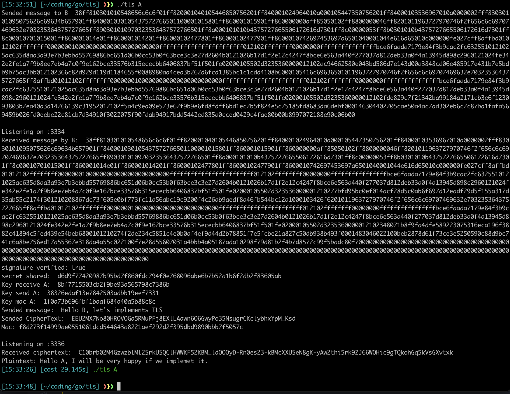
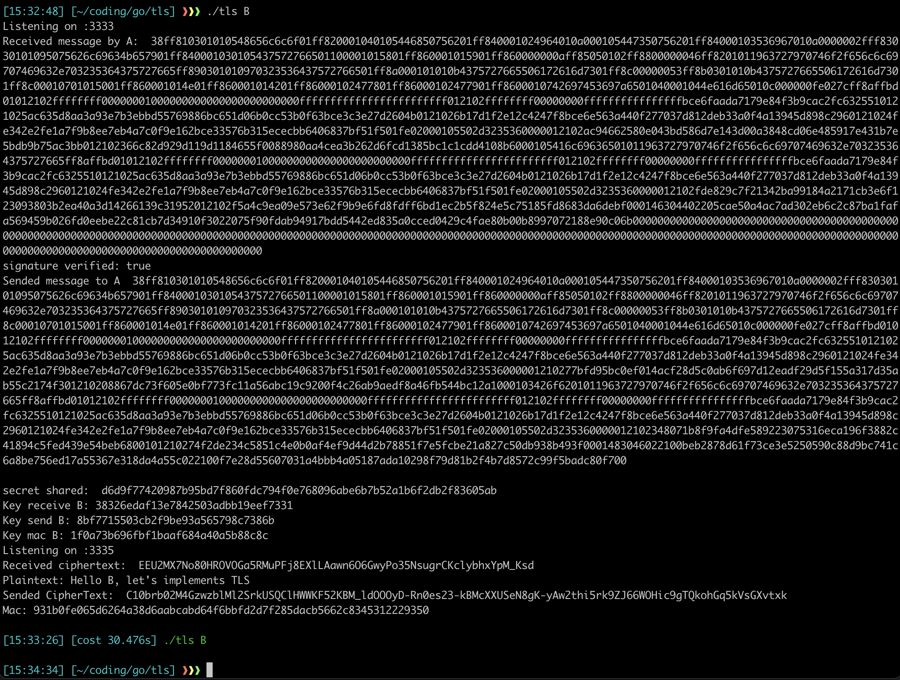

# _TLS_
## Build
```sh
go build
```
## Run
```
./tls <mode> <id> <message>
```
There are two modes, one for A and the other one for B.

Example for A:
```
./tls "A" "Alice" "Hello Bob, this is secret message"
```
Example for B:
```
./tls "B" "Bob" "Hello Alice, I will keep this message like a secret"
```
`Note that, this code is for local using. If you don't want to get an error please run an instance for B then run an instance for A.`

## Outputs
Output A


Output B
